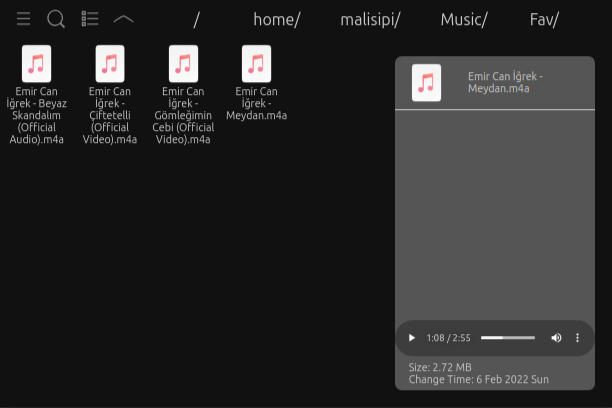

# Local File Explorer <!--[](https://addons.mozilla.org/en-US/firefox/addon/local-file-explorer/reviews/)-->

### Don't require leave your web browser to look your files!

<center>



</center>

<a href="https://addons.mozilla.org/addon/local-file-explorer/" target="_blank"></a>

> Local File Explorer is a simple and fast file browser extension for Firefox and Chromium web browsers.

* You can view your folders,
* Preview your images/videos/musics without opening new tab,
* Previews of images in folder view
* Search files in folder,
* Customize folder view (grid/list mode and 5 level zoom option)

## Package the extension

### Firefox

* ```make firefox```

### Chrome

* ```make chrome```

## License

* This project is licensed by Apache 2.0 License.
* Yaru icons and app icon (`assets` and `assets_src`) is licensed by CC BY SA 4.0 License.
